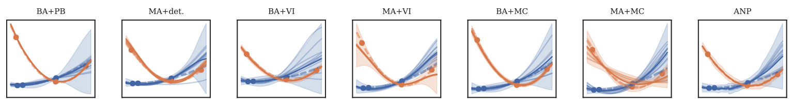

# Neural Processes in PyTorch
## What is this?
This is a [PyTorch](https://pytorch.org) implementation of various Neural Process (NPs) variants, including [Standard NPs [1]](https://arxiv.org/abs/1807.01622), [Self-attentive NPs [2]](https://arxiv.org/abs/1901.05761), and [NPs with Bayesian Aggregation [3]](https://openreview.net/forum?id=ufZN2-aehFa).



Plots taken from [3].

[1] Garnelo et al., "Neural Processes", ICML 2018 Workshop on Theoretical Foundations and Applications of Deep Generative Models

[2] Kim et al., "Attentive Neural Processes", ICLR 2019

[3] Volpp et al., "Bayesian Context Aggregation for Neural Processes", ICLR 2021
## Getting Started
First install ```metalearning_benchmarks``` from [here](https://github.com/michaelvolpp/metalearning_benchmarks).

Then clone this repository and run
```
pip install . 
```
from the source directory.

To get familiar with the code, have a look at the example script ```./scripts/run_neural_process.py```.

## Notes
This code is still in development and thus not all features are thoroughly tested. Some features may change in the future. It was tested only with the packages listed in ```./setup.cfg```.

## License
This code is licensed under the MIT license and is free to use by anyone without any restrictions.

